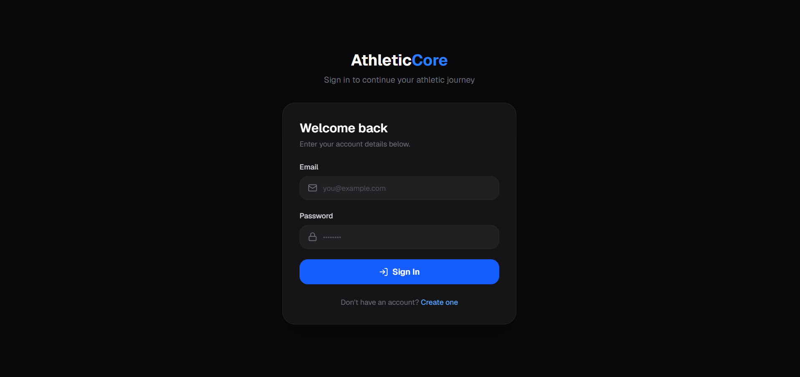
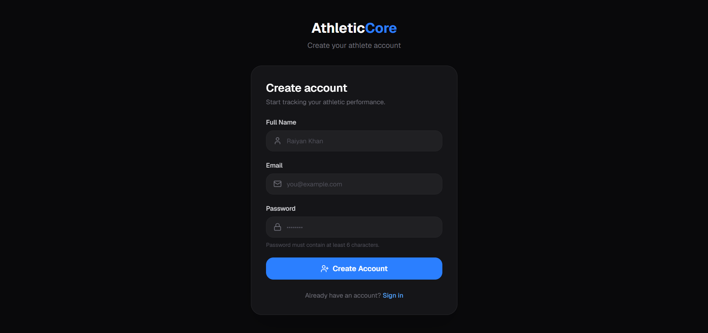
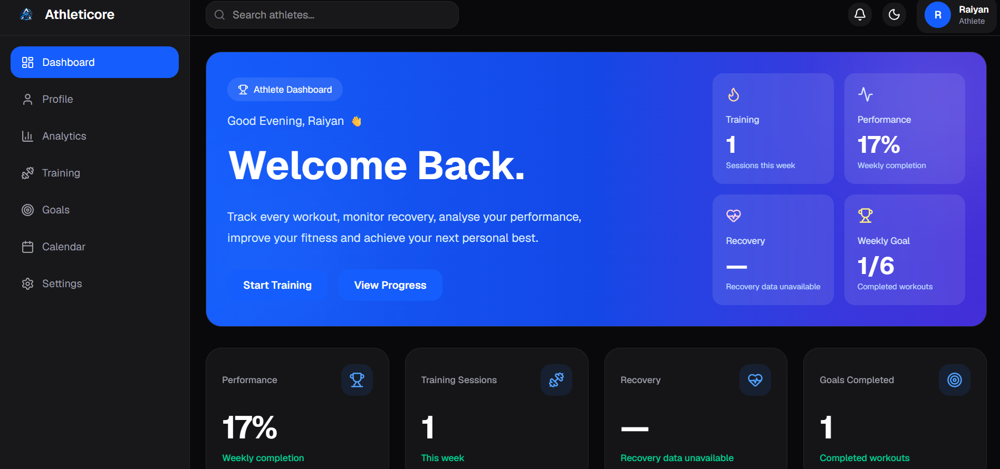
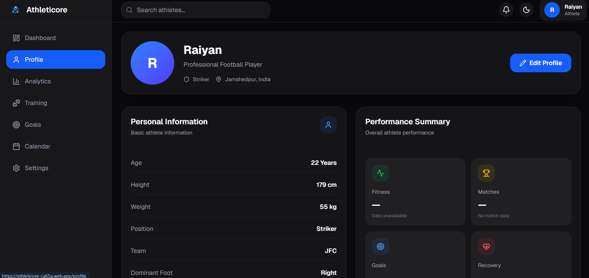
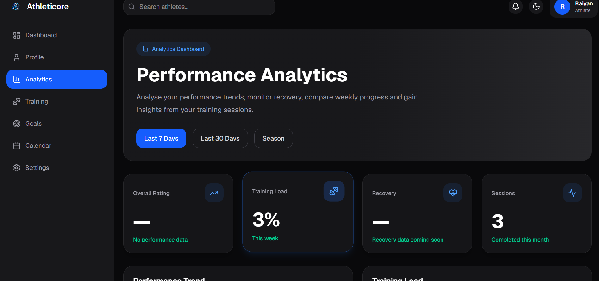
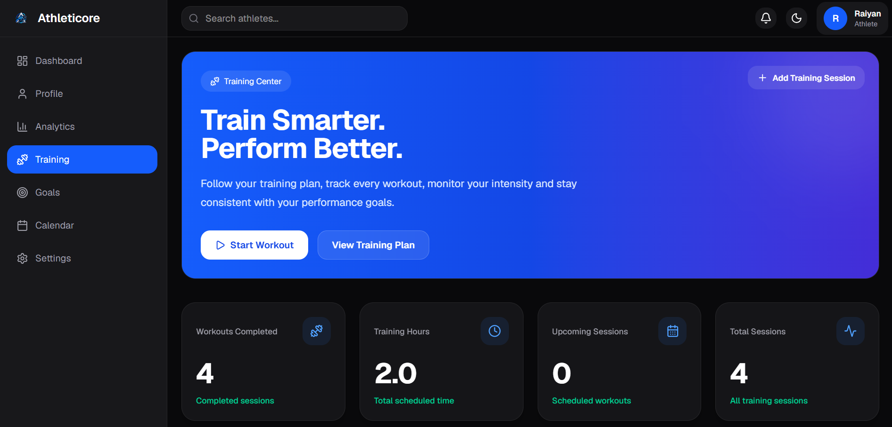
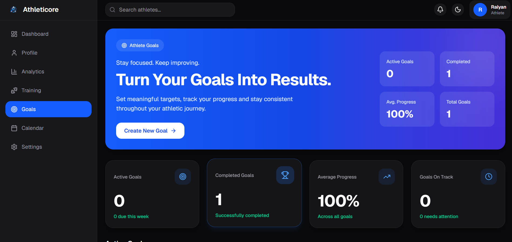
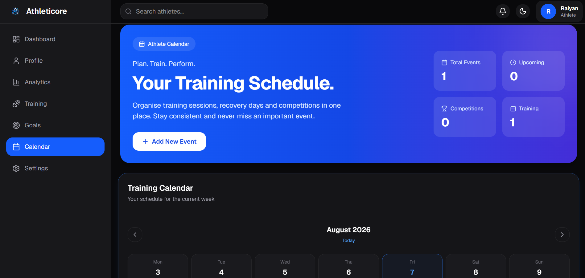
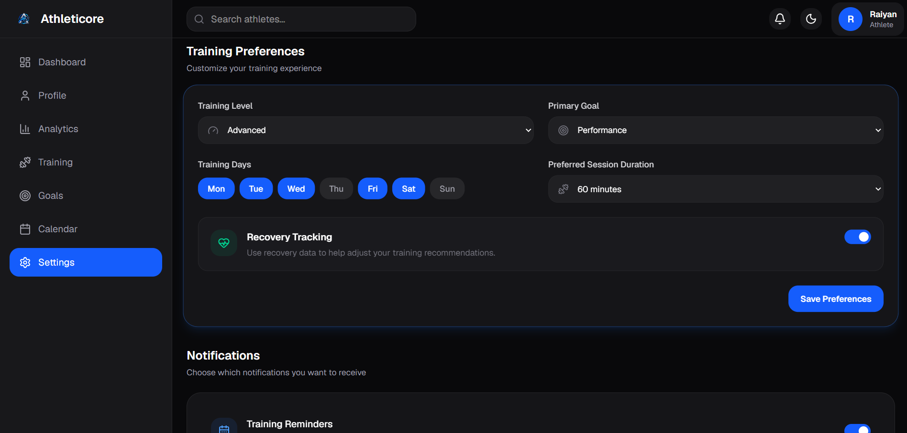

# ⚡ AthletiCore

> AI-Powered Athlete Management Platform built with React, TypeScript & Firebase.


---

## 🌐 Live Demo

🔗 https://athleticore-ca65a.web.app/

---

## 📌 Overview

AthletiCore is a modern athlete management platform that helps athletes monitor their training, performance, goals, and progress through an interactive dashboard.

The application enables athletes to schedule training sessions, analyze performance metrics, manage goals, and gain AI-powered insights from their recorded data.

---

## ✨ Features

### 🏠 Dashboard

- Personalized dashboard
- Performance summary
- Training statistics
- Recent activity
- Personal best tracking
- Achievement cards

---

### 👤 Athlete Profile

- Edit athlete information
- Height, weight, age
- Team & position
- Dominant foot
- Training preferences

---

### 📊 Analytics

- Performance Trend Chart
- Training Load Analysis
- Skill Distribution
- AI Performance Insights
- Recovery section

---

### 💪 Training Management

- Schedule workouts
- Track completed sessions
- Update training status
- Weekly training overview

---

### 🎯 Goal Management

- Create goals
- Track progress
- Completion percentage
- Goal status updates

---

### 📅 Calendar

- Add events
- Edit events
- Delete events
- Upcoming events
- Monthly calendar

---

### ⚙ Settings

- Profile settings
- Notification preferences
- Training preferences
- Appearance settings

---

### 🔐 Authentication

- Email & Password Login
- User Registration
- Secure Authentication
- Protected Routes

---

## 🛠 Tech Stack

### Frontend

- React
- TypeScript
- Vite
- Tailwind CSS
- Framer Motion
- Recharts
- Lucide React

### Backend

- Firebase Authentication
- Cloud Firestore

### Deployment

- Firebase Hosting

---

## 📂 Project Structure

```text
src/
│
├── components/
├── features/
│   ├── athlete/
│   ├── auth/
│
├── services/
│   └── firebase/
│
├── hooks/
├── layouts/
├── pages/
└── routes/
```

---

## 📸 Screenshots

## 📸 Screenshots

### 🔐 Login



---

### 📝 Register



---

### 🏠 Dashboard



---

### 👤 Profile



---

### 📊 Analytics



---

### 💪 Training



---

### 🎯 Goals



---

### 📅 Calendar



---

### ⚙️ Settings



---

## 🚀 Installation

Clone the repository

```bash
git clone https://github.com/RaiyanCoder7/AthletiCore.git
```

Go to project folder

```bash
cd AthletiCore
```

Install dependencies

```bash
npm install
```

Create a `.env` file

```env
VITE_FIREBASE_API_KEY=YOUR_API_KEY
VITE_FIREBASE_AUTH_DOMAIN=YOUR_AUTH_DOMAIN
VITE_FIREBASE_PROJECT_ID=YOUR_PROJECT_ID
VITE_FIREBASE_STORAGE_BUCKET=YOUR_STORAGE_BUCKET
VITE_FIREBASE_MESSAGING_SENDER_ID=YOUR_MESSAGING_SENDER_ID
VITE_FIREBASE_APP_ID=YOUR_APP_ID
```

Run the development server

```bash
npm run dev
```

Build for production

```bash
npm run build
```

---

## 🔒 Security

- Firebase Authentication
- Firestore Security Rules
- User-specific data isolation
- Protected routes

---

## 🚀 Future Improvements

- Coach Dashboard
- Admin Panel
- Athlete Profile Photos
- AI Training Recommendations
- Injury Prediction
- Push Notifications
- PDF Reports
- Mobile App
- Team Management
- Performance Forecasting

---

## 👨‍💻 Author

**Md Raiyan Raza Khan**

GitHub:
https://github.com/RaiyanCoder7

LinkedIn:
https://www.linkedin.com/in/mdraiyanrazakhan

---

## ⭐ Support

If you like this project, consider giving it a ⭐ on GitHub.

It helps the project grow and motivates future development.

---

## 📄 License

This project is licensed under the MIT License.