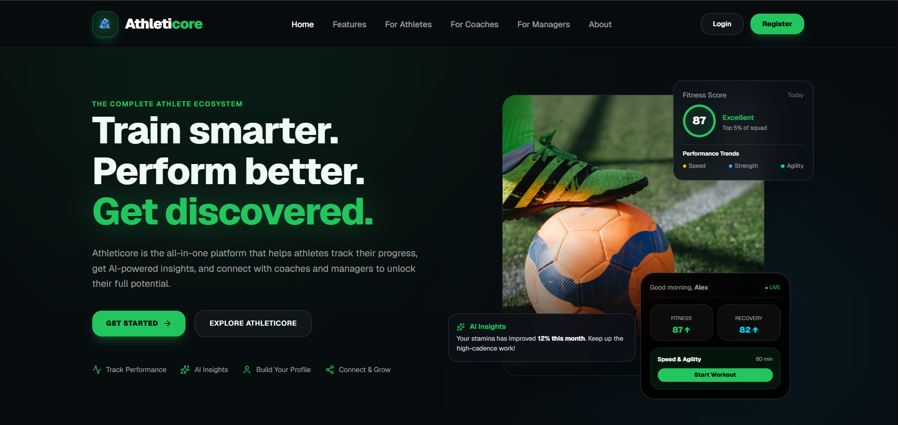
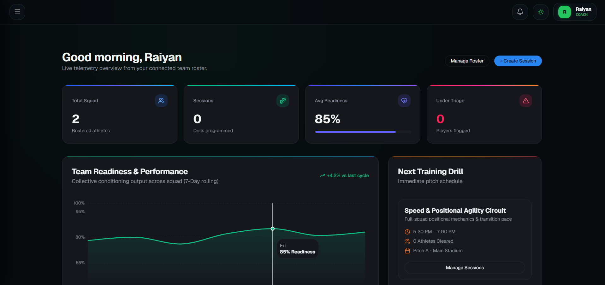

# ⚡ AthletiCore

> **AI-Powered Athlete Development & Management Platform**  
> Built with React 19, TypeScript, Tailwind CSS & Firebase.

[](https://react.dev/)
[](https://www.typescriptlang.org/)
[](https://firebase.google.com/)
[](https://vitejs.dev/)
[](https://opensource.org/licenses/MIT)

---

## 🌐 Live Demo

🔗 https://athleticore-ca65a.web.app/

---

## 📌 Overview

**AthletiCore** is a modern athlete development and management platform engineered to connect athletes and coaches through centralized performance telemetry, structured training schedules, goal tracking, and predictive analytics.

- **Athletes** manage training regimens, match statistics, personal bests, and career milestones through a real-time reactive dashboard.
- **Coaches** monitor squad metrics, assess recovery, review performance curves, and schedule squad-level training drills from a centralized coaching hub.
- **Vision:** Transform raw athletic telemetry into actionable performance intelligence using AI-driven analytics, computer vision, and wearable data integrations.

> *"From tracking performance → to understanding performance."*

---

## ✨ Features

### 🌐 Landing & Discovery
* Responsive marketing layout introducing platform value propositions for athletes, coaches, and sports organizations.
* Role-tailored access paths and registration entry points.

### 🏠 Athlete Dashboard
* Real-time metrics overview: session streaks, training load, upcoming fixtures, and personal best milestones.
* Dynamic activity visualizations and upcoming calendar schedules.

### 👤 Comprehensive Athlete Profiles
* Biometric logging: age, height, weight, dominant foot, team designation, and tactical positions.
* Historical records: verified achievements, tournament match logs, and training preferences.

### 📊 Analytics Engine
* Volume and intensity load tracking via interactive Recharts visualizations.
* Metric breakdowns covering tactical proficiency, recovery states, and historic trendlines.

### 💪 Training & Fixture Management
* Drill, workout, and session scheduling with duration and perceived exertion logging.
* Match logger tracking opponent data, match outcomes, competition tiers, and individual contributions.

### 🎯 Goal Tracking & Calendar
* Multi-stage goal setup with visual percentage completion bars.
* Centralized monthly calendar with full event scheduling and category tagging.

### 🧑‍🏫 Coach Command Center
* Multi-athlete roster management with keyword search and performance filtering.
* Centralized squad metrics to diagnose fatigue and plan microcycles.

### 🔐 Security & Identity
* Multi-role authentication (Athlete, Coach, Manager) backed by Firebase Auth and Google Sign-In.
* Cloud Firestore security rules ensuring strict user-level data isolation.

---

## 🛠 Tech Stack

| Domain | Technologies |
| :--- | :--- |
| **Frontend** | React 19, TypeScript, Vite, Tailwind CSS, Framer Motion |
| **Data Viz & UI** | Recharts, Lucide React, React Router 6+ |
| **Backend & Cloud** | Firebase Authentication, Cloud Firestore, Firebase App Check |
| **Deployment** | Firebase Hosting, GitHub Actions |

---

## 📂 Project Structure

```text
AthletiCore/
├── src/
│   ├── assets/             # Static graphics and icons
│   ├── components/         # Global reusable atomic UI elements
│   │   ├── layout/         # Navbars, sidebars, and shell containers
│   │   └── ui/             # Buttons, inputs, modal dialogs, cards
│   ├── features/           # Domain-driven modular features
│   │   ├── athlete/        # Athlete metrics, profiles, and dashboards
│   │   ├── coach/          # Coach roster views and squad analytics
│   │   └── auth/           # Login, registration, and session logic
│   ├── hooks/              # Custom React hooks (state, Firestore listeners)
│   ├── pages/              # Top-level view routes
│   ├── services/           # External API & Firebase service initializers
│   ├── routes/             # App routing and role-guarded access paths
│   ├── App.tsx             # Root component
│   └── main.tsx            # Entry point
```
---

## 📸 Screenshots

### 🔐 Landing Page



---

### 📝 Login


---

### 📝 Register


---

### 🏠 Dashboard


---

### 👤 Profile


---

### 📊 Analytics


---

### 💪 Training


---

### 🎯 Goals


---

### 📅 Calendar


---

### ⚙️ Coach Dashboard



---

### ⚙️ Settings


---

## 🚀 Installation

Clone the repository

```bash
git clone https://github.com/RaiyanCoder7/AthletiCore.git
```

Go to project folder

```bash
cd AthletiCore
```

Install dependencies

```bash
npm install
```

Create a `.env` file

```env
VITE_FIREBASE_API_KEY=YOUR_API_KEY
VITE_FIREBASE_AUTH_DOMAIN=YOUR_AUTH_DOMAIN
VITE_FIREBASE_PROJECT_ID=YOUR_PROJECT_ID
VITE_FIREBASE_STORAGE_BUCKET=YOUR_STORAGE_BUCKET
VITE_FIREBASE_MESSAGING_SENDER_ID=YOUR_MESSAGING_SENDER_ID
VITE_FIREBASE_APP_ID=YOUR_APP_ID
```

Run the development server

```bash
npm run dev
```

Build for production

```bash
npm run build
```

---

## 🔒 Security

- Firebase Authentication
- Firestore Security Rules
- User-specific data isolation
- Protected routes

---

## 🚀 Future Improvements

- Admin Panel
- Athlete Profile Photos
- AI Training Recommendations
- Injury Prediction
- Push Notifications
- PDF Reports
- Mobile App
- Team Management
- Performance Forecasting

---

## 👨‍💻 Author

**Md Raiyan Raza Khan**

GitHub:
https://github.com/RaiyanCoder7

LinkedIn:
https://www.linkedin.com/in/mdraiyanrazakhan

---

## ⭐ Support

If you like this project, consider giving it a ⭐ on GitHub.

It helps the project grow and motivates future development.

---

## 📄 License

This project is licensed under the MIT License.